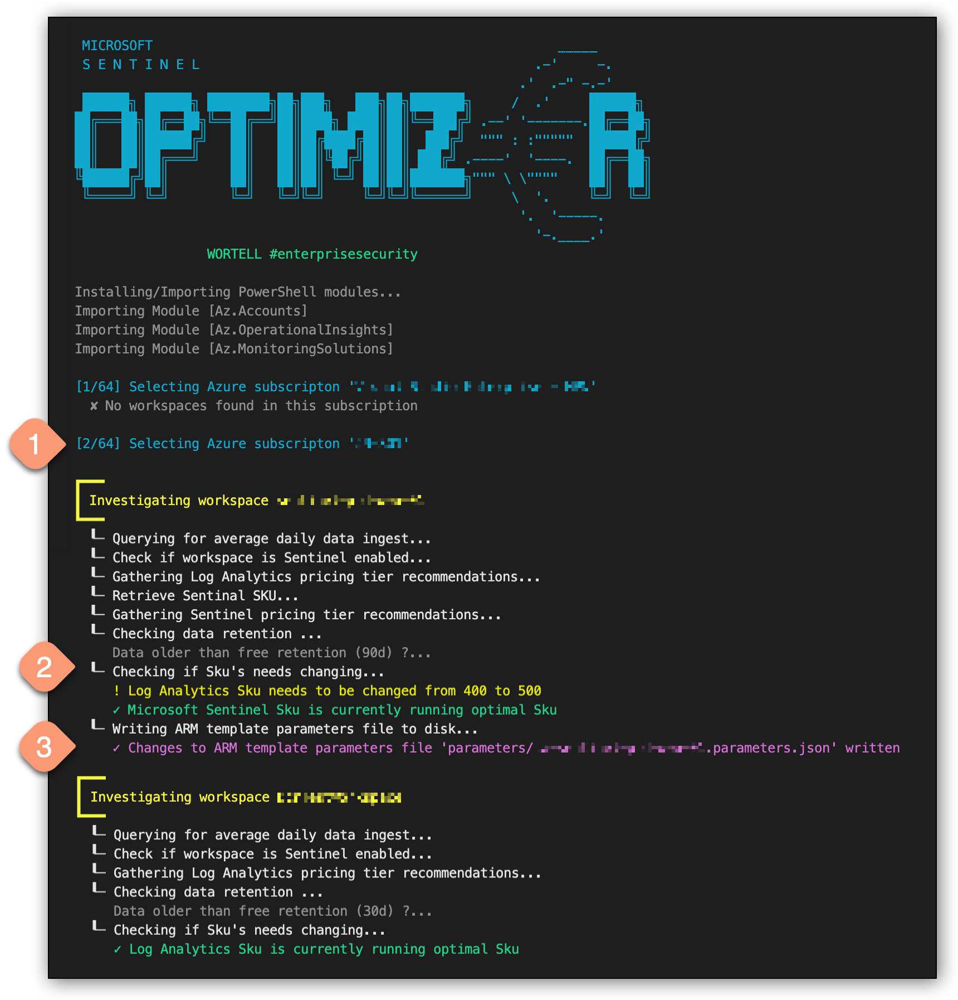

# AzSentinelPricingOptimizer.ps1
### *AKA: Sentinel `0ptimiz€r`*

## Medium Article

I wrote two articles about this subject on Medium. Check it out for more background information about this repository:

Story from Febuary 2022
https://medium.com/wortell/optimize-microsoft-sentinel-pricing-ca9901840b75

Story from November 2022
<https://medium.com/@koosg/auto-scale-your-sentinel-pricing-tiers-3d1f46b4c6ce>

## Overview

This script will check all Log Analytics workspaces in your environment to see if you're using the most optimal pricing tier.
For Microsoft Sentinel there's an extra layer on top of a workspace with its own pricing tier as well. And the thresholds for both of these isn't as straightforward as one might think.
I see a lot of workspaces costing more money than they should have. So hopefully this script and its outcome will save you some money.

- It will first loop through all your subscriptions
- Then it will loop through all Log Analytics workspaces and perform a KQL query against it to determine the average daily data ingest based on the last month
- It will compare this result with a fixed table of thresholds (set at the beginning of the script) to determine what the optimal pricing tier should be
- Lastly, it will check if the Sentinel solution is enabled on the workspace and will repeat the comparison but with a different table with different values this time
- All outcomes across all workspaces will be gathered in over overview and will automatically be exported as a CSV in the end


> Example of Powershell output

### Update

The Script will now also retrieve the current Sentinel Sku by leveraging an API. And it can now also update any ARM template parameters files corrosponding to the workspace deployments for you. This can be really handy to built a fully automated auto-scale solution for your pricing tiers.


> Example of Powershell output

Example:
```
./powershell-script/AzSentinelPricingOptimizer.ps1 `
    -subscriptionId 'c2a97e8b-592d-442a-aef5-9e5a6347350d' `
    -updateArmParameters $true `
    -parametersFilePath 'arm-templates/'
```
It can be used with these optional parameters as well:
- `subscriptionId ` -  If not specified the script will cycle through all Azure subscription you have at least read access to and look for workspaces inside each subscription. For auto-scaling purposes inside a Github workflow it's best to provide a single subscriptionId.
- `updateArmParameters ` -  Default is $false and will only report current Sku and optimal Sku values. Set to $true if you want the script to write changes to ARM template parameter files.
- `parametersFilePath ` -  Provide a path to your ARM template parameters files. The script assumes the filenames are the same as the workspace names. If left empty, the script will prompt you for a path if updateArmParameters is set to $true.

<br>

## Pricing tier thresholds

Please note that the threshold for these pricing tiers are determined based on the actual 'list' prices as of February 2nd 2022 based on the West Europe region.
If you're using a different region, and/or are receiving discounts through Microsoft, please update the tables accordingly.
To help you with this you can use my Excel calculator sheet provided in this repository as well. Fill in your current prices for each tier, and the Excel sheet will calculate all thresholds.


> Example of Excel sheet which can help you determine your optimal pricing tier thresholds
