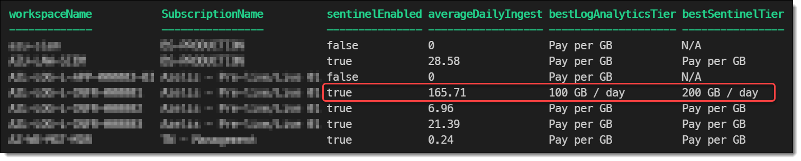
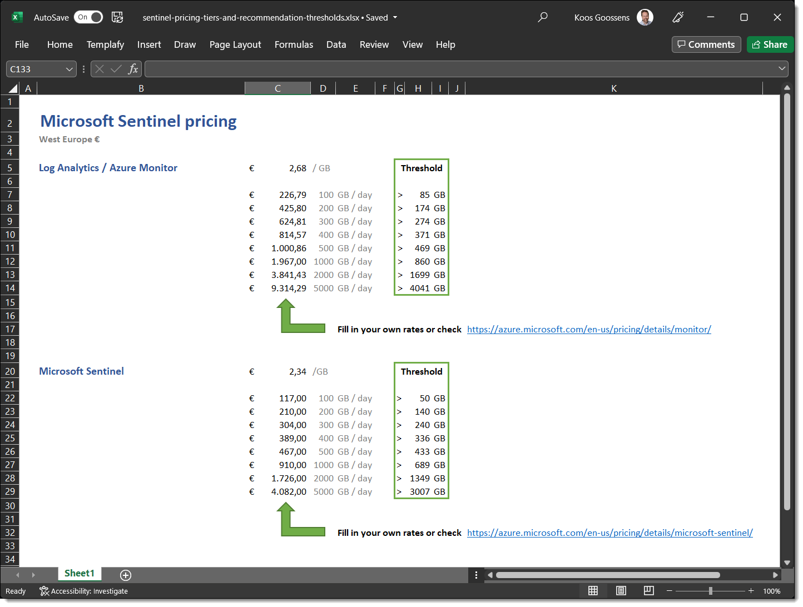

# Get-AzSentinelPricingRecommendation.ps1

## Medium Article

I wrote an article about this subject on Medium. Check it out for more background information about this repository:

https://medium.com/wortell/optimize-microsoft-sentinel-pricing-ca9901840b75

## Overview

This script will check all Log Analytics workspaces in your environment to see if you're using the most optimal pricing tier.
For Microsoft Sentinel there's an extra layer on top of a workspace with its own pricing tier as well. And the thresholds for both of these isn't as straightforward as one might think.
I see a lot of workspaces costing more money than they should have. So hopefully this script and its outcome will save you some money.

- It will first loop through all your subscriptions
-  Then it will loop through all Log Analytics workspaces and perform a KQL query against it to determine the average daily data ingest based on the last month
- It will compare this result with a fixed table of thresholds (set at the beginning of the script) to determine what the optimal pricing tier should be
- Lastly, it will check if the Sentinel solution is enabled on the workspace and will repeat the comparison but with a different table with different values this time
- All outcomes across all workspaces will be gathered in over overview and will automatically be exported as a CSV in the end

> Example of Powershell output

 

## Pricing tier thresholds

Please note that the threshold for these pricing tiers are determined based on the actual 'list' prices as of February 2nd 2022 based on the West Europe region.
If you're using a different region, and/or are receiving discounts through Microsoft, please update the tables accordingly.
To help you with this you can use my Excel calculator sheet provided in this repository as well. Fill in your current prices for each tier, and the Excel sheet will calculate all thresholds.

> Example of Excel sheet which can help you determine your optimal pricing tier thresholds

## Prerequisites
Ensure that the following Powershell modules are installed
- Az
- Az.MonitoringSolutions
